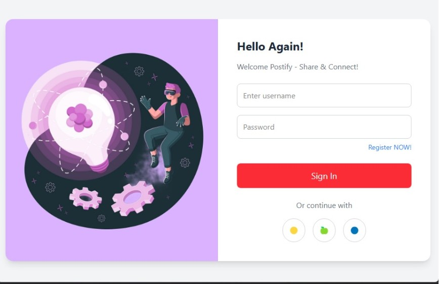
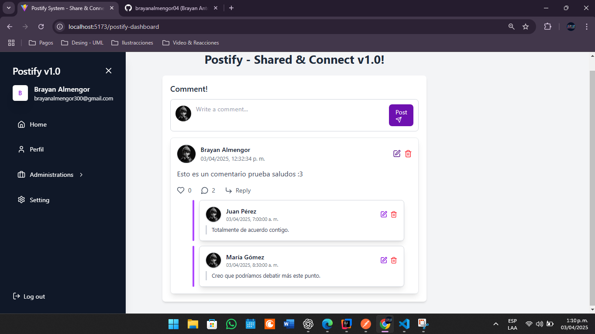
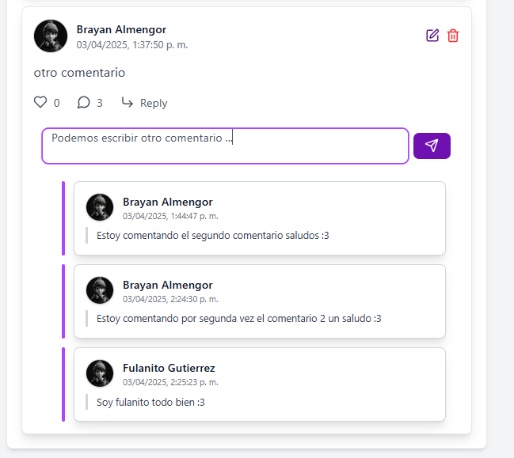
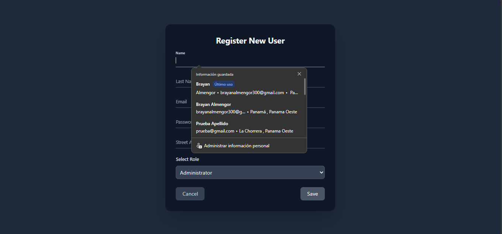

# 🚀 Postify - Share & Connect

Welcome to **Postify - Share & Connect**, an interactive web application where users can create posts, comment, and participate in raffles. Engage with others, customize your profile, and enjoy a seamless social experience. 💬🎉

---

## 📌 Features
- ✍️ **Create & Share**: Post your thoughts and engage with others.
- 💬 **Comments & Replies**: Interact with posts through comments and replies.
- 🎟️ **Raffles & Rewards**: Participate in exciting raffles.
- 🎨 **Customizable Profiles**: Personalize your experience.

---

## 📂 Project Structure
```
/postify-backend
│── .mvn/                     # Maven wrapper
│── src/
│   ├── main/java/com/brayanalmengor04/postify/
│   │   ├── config/       # Configuration classes
│   │   ├── controller/   # REST Controllers
│   │   ├── entity/       # Entity models
│   │   ├── enums/        # Enumerations
│   │   ├── repository/   # Data access layer
│   │   ├── security/     # Security configuration
│   │   ├── service/      # Business logic
│   │   ├── PostifyApplication.java  # Main application class
│   ├── resources/        # Static resources
│   ├── test/             # Test cases
│── .gitignore             # Git ignore rules
│── docker-compose.yml     # Docker configuration
│── README.md              # Project overview
```

---

## ⚙️ Tech Stack
| **Category**    | **Technologies**             |
|----------------|-----------------------------|
| **Frontend**   | React, TailwindCSS          |
| **Backend**    | Spring Boot, REST API       |
| **Database**   | MySQL 8.0.3                  |

---

## 🚀 Getting Started
### 1️⃣ Clone the repositories
```bash
git clone https://github.com/brayanalmengor04/postify-backend.git
cd postify
```
For the frontend, clone the repository:
```bash
git clone https://github.com/brayanalmengor04/postify-frontend.git
```

### 2️⃣ Backend Setup
```bash
cd backend
mvn spring-boot:run
```

### 3️⃣ Frontend Setup
```bash
cd frontend
npm install
npm run dev
```
---
## 🖼️ Screenshots
### 🔐 Login Page
  
_Users can log in using their credentials to access the platform._

### 📊 Dashboard

_Overview of user activities, including posts, comments, and interactions._

### 💬 Comments Section

_Users can comment on posts and engage in discussions._

### 🆕 New User Registration

_New users can sign up and create an account to start posting._

---

## 📜 API Endpoints
### 🔐 Authentication
| Method | Endpoint               | Description   |
|--------|------------------------|---------------|
| POST   | /auth/signin           | User login    |
| POST   | /auth/signup           | User signup   |

### 💬 Comments
| Method | Endpoint              | Description          |
|--------|----------------------|----------------------|
| GET    | /comment             | Fetch all comments  |
| POST   | /comment-add         | Create a comment    |
| PUT    | /comment/{id}        | Update a comment    |
| DELETE | /comment/{id}        | Delete a comment    |

### 💬 Replies
| Method | Endpoint             | Description           |
|--------|----------------------|-----------------------|
| GET    | /reply/all           | Fetch all replies     |
| POST   | /reply/user          | Create a reply        |
| GET    | /reply/user/{userId} | Fetch reply by userID |

### 🛡️ Roles
| Method | Endpoint             | Description       |
|--------|----------------------|-------------------|
| GET    | /role               | Get all roles    |
| POST   | /role-add           | Add a new role   |
| GET    | /role/{id}          | Get role by ID   |
| PUT    | /role/{id}          | Update a role    |
| DELETE | /role/{id}          | Delete a role    |

---
## 💡 Contributing
We welcome contributions! 🚀

1. **Fork** the repository 🍴
2. **Create a feature branch** (`git checkout -b feature-name`) 🌱
3. **Commit changes** (`git commit -m 'Add new feature'`) 💾
4. **Push to branch** (`git push origin feature-name`) 🚀
5. **Submit a Pull Request** 📩
---
## 📜 License
This project is licensed under the **MIT License**. See the [LICENSE](LICENSE) file for details.

---

**🚀 Join us and start sharing today! Let’s build something amazing together! 🔥**

